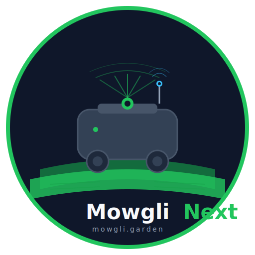
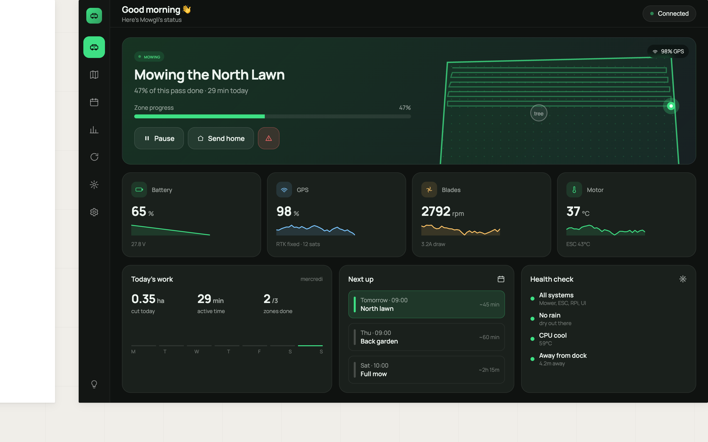

<p align="center">
  
</p>

<p align="center">
  Autonomous robot mower built on ROS2 Kilted — RTK-GPS sensor fusion,<br>
  LiDAR drift correction, behavior trees, and intelligent coverage planning.
</p>

<p align="center">
  <strong><a href="https://mowgli.garden">Website</a></strong> · <strong><a href="https://github.com/cedbossneo/mowglinext/wiki">Wiki</a></strong> · <strong><a href="https://github.com/cedbossneo/mowglinext/discussions">Discussions</a></strong> · <strong><a href="https://github.com/cedbossneo/mowglinext/issues">Issues</a></strong>
</p>

---

> **Beta — Work in Progress**
>
> MowgliNext is under active development and **not ready for production use**. We're building in the open and welcome early adopters.

---

## What It Does

A fully autonomous mowing stack running on real hardware: undock, navigate to zones, mow strip-by-strip with sub-centimeter accuracy, avoid obstacles, dock to charge, and resume.

**Core:** FusionCore UKF (GPS + IMU + wheels, 100 Hz) · Kinematic-ICP LiDAR drift correction · Nav2 navigation · BehaviorTree.CPP v4 · cell-based strip coverage planner

**Hardware:** YardForce chassis · ARM64 SBC (RK3566/RK3588, RPi 4/5) · u-blox F9P RTK-GPS · LDRobot LD19 LiDAR · STM32 firmware

See the **[Architecture wiki page](https://github.com/cedbossneo/mowglinext/wiki/Architecture)** for full system design and data flow.

## Dashboard

<p align="center">
  
</p>

State-adaptive hero card with live sparkline telemetry, health checks, and contextual actions. Weekly schedule grid, statistics with bar charts, and full Mapbox map editor. Dark & light themes, responsive mobile layout.

See the **[GUI wiki page](https://github.com/cedbossneo/mowglinext/wiki/GUI)** for all pages and design details.

## Quick Start

Visit [mowgli.garden](https://mowgli.garden/#getting-started) to pick your hardware and get a personalized install command, or:

```bash
curl -sSL https://mowgli.garden/install.sh | bash
```

GUI at `http://<mower-ip>:4006` · See **[Getting Started](https://github.com/cedbossneo/mowglinext/wiki/Getting-Started)** for full setup.

## Monorepo

| Directory | Description |
|-----------|-------------|
| [`ros2/`](ros2/) | ROS2 stack: Nav2, FusionCore, Kinematic-ICP, BT, coverage, hardware bridge |
| [`gui/`](gui/) | React + Go web interface |
| [`firmware/`](firmware/) | STM32 motor control, IMU, blade safety |
| [`install/`](install/) | Interactive installer, Docker Compose configs |
| [`sensors/`](sensors/) | Dockerized GPS & LiDAR drivers |
| [`docs/`](docs/) | GitHub Pages at [mowgli.garden](https://mowgli.garden) |

## Documentation

| Resource | Content |
|----------|---------|
| **[Wiki](https://github.com/cedbossneo/mowglinext/wiki)** | Architecture, configuration, deployment, sensors, firmware, BT, GUI, FAQ |
| **[Website](https://mowgli.garden)** | Landing page, install composer, features overview |
| **[First Boot](docs/FIRST_BOOT.md)** | Post-install checklist |

## A Word About OpenMower

MowgliNext exists because of [OpenMower](https://openmower.de/). They proved robot mowers can be truly intelligent. OpenMower replaces the stock electronics with custom boards; Mowgli works with existing hardware, adding capabilities on top. Different paths, same goal: smarter mowers for everyone. Thank you, OpenMower team.

## Contributing

We welcome contributions! See the [Contributing Guide](CONTRIBUTING.md) and [AI-Assisted Contributing](https://github.com/cedbossneo/mowglinext/wiki/AI-Assisted-Contributing).

## Acknowledgments

- **[cloudn1ne](https://github.com/cloudn1ne)** — original Mowgli reverse engineering
- **nekraus** — countless late nights making things work
- **[OpenMower](https://openmower.de/)** — proving robot mowers can be intelligent
- **Mowgli French Community** — testing, feedback, encouragement
- **Every Mowgli user** — every install and bug report keeps us going

## License

[GPLv3](LICENSE) — same as OpenMower, because open source is how we all win.
